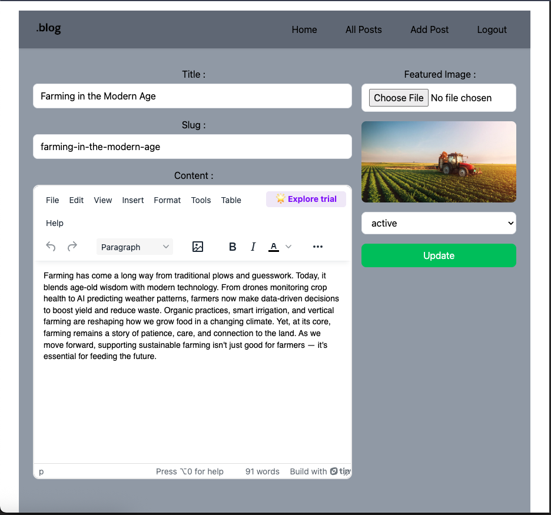
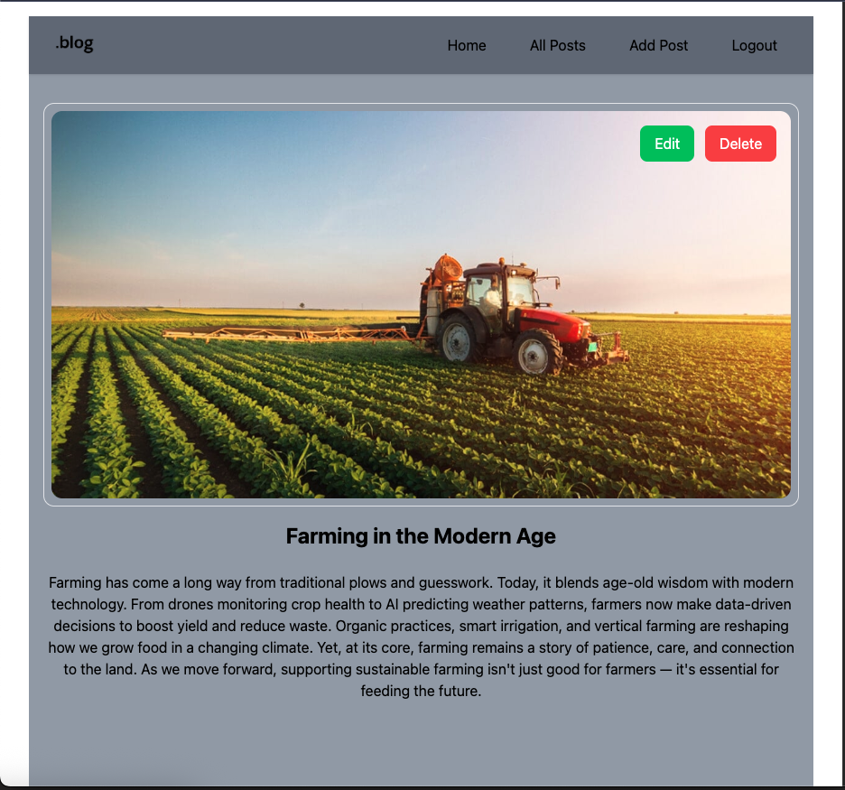
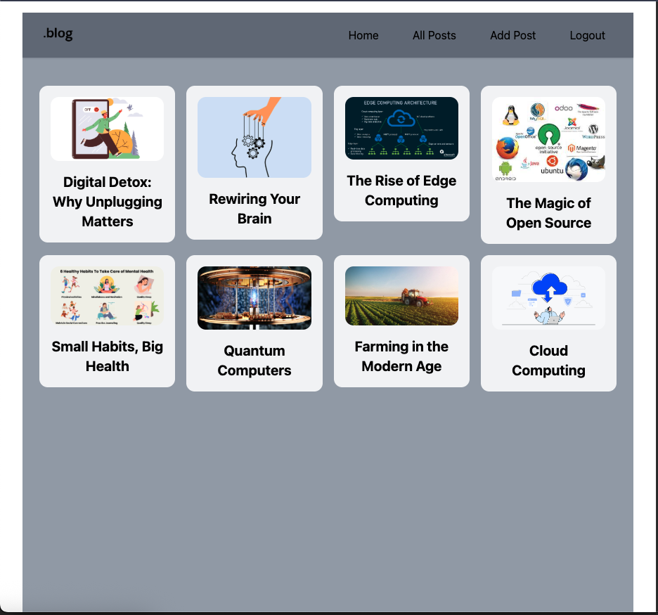
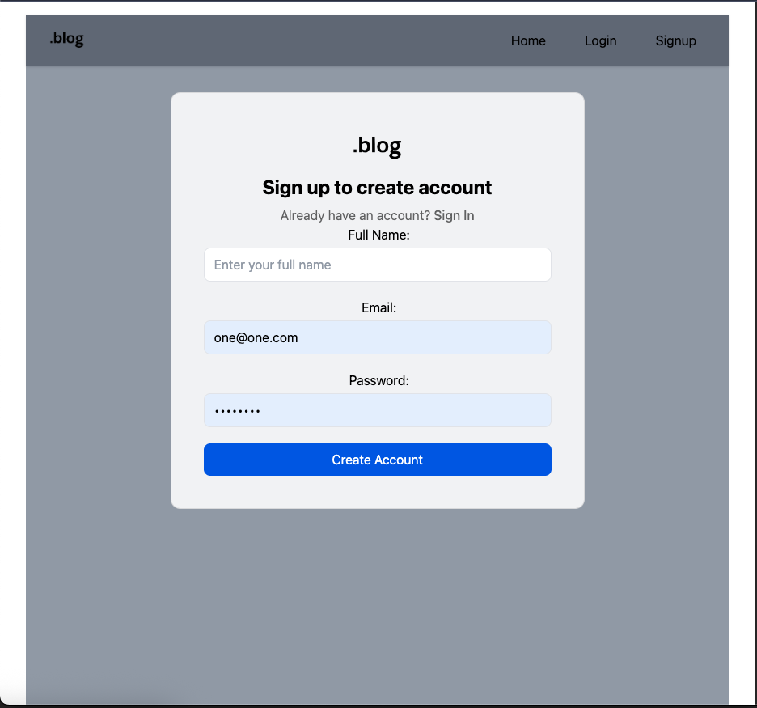
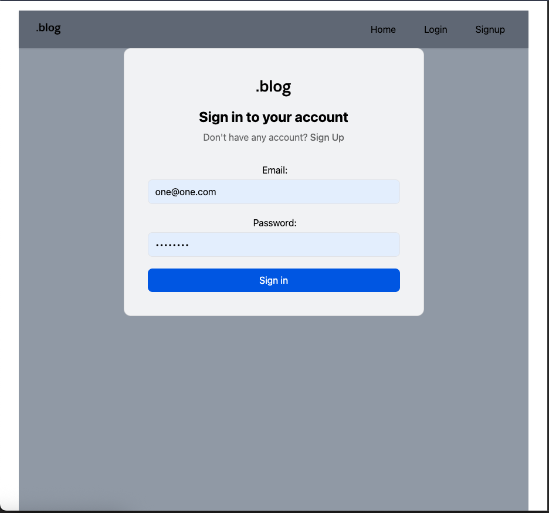

# BlogPost Application

A full-featured blog platform built with React, Redux, Appwrite, and TailwindCSS. Users can create, edit, and view blog posts, as well as manage authentication with signup and login functionality.

## Features

-   Create new blog posts with rich text and images
-   Edit existing posts
-   View individual blog posts
-   Browse all blog posts
-   User authentication (Signup & Login)
-   Responsive UI with TailwindCSS

---

## 🛠️ Tech Stack

-   React
-   Redux Toolkit
-   Appwrite
-   TailwindCSS
-   React Router

---

## ✍️ Create and Edit Blog Post

-   Navigate to **Add Post** after logging in.
-   Fill in the title, slug, content (with rich text editor), featured image, and status.
-   Submit to publish your post.

## 📄 Single Blog Post

-   Click any post card to view its details.
-   See the full content, featured image, and author information.
-   Authors can edit or delete their own posts.

## 📚 All Blog Posts

-   Access **All Posts** from the navigation bar.
-   Browse all published posts in a grid layout.

## 🔐 Signup

-   Click **Signup** in the navigation bar.
-   Enter your name, email, and password to create an account.

## 🔑 Login

-   Click **Login** in the navigation bar.
-   Enter your email and password to access your account.

---
